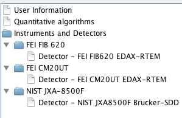

DTSA-II Setup
========================================================

These are John Minter's tips for setting up a consistent
DTSA-II installation across several computers with
different operating systems. There are some exemplar 
macros. The first section in this document I call
***Alchemy*** because they are useful tips I learned,
often the hard way...

# Alchemy

## Getting main menus to work under MacOSX
To get DTSA-Gemini to work on my MacOSX 10.8 (Mountain
Lion) laptop, I use the Linux version and start with a
shell scripts. Upon starting, the main menus are greyed
out. To get them to work, I need to:
1. Select the "Help" menu and type "DTSA" in the search box
2. Select the first item (about) and let it open the window
3. Close this window and the menus work as expected...

## Java Exceptions from quantify claiming spectra are unequal lengths.
I think there is a 4000 maximum length. Spectra from EDAX are 4096 observations long. I've tried clipping spectra but this only seems to work if the detector uses the initial calibration. If one uses the ``Calibration alien'' things crash again, even if the spectra have the same calibration hash. Grrr. Reported this to Nick Ritchie. For now, just use the manufacturers' routines...

## Consistent spectrum display

If you have a series of Scriptable spectrum objects, ``spec[i]`` and you
display them with ``spec[i].display()`` they will all be displayed with
the same color. You typically don't want this. If you instead
``display(spec[i])``, they will have different colors.

# Initial setup

Our goal is to get ***consistent*** detectors and
standards. At the moment, much of this is kludgy.
DTSA seems to make it hard to change some of the
defaults. My long term goal is to be able to create
a reproducible environment from Jython scripts that
set up instruments, detectors, and standards from
version control.

## Instrument/Detector setup

Note: I did try saving a 7zip archive of a base system
set up this way. We'll see if it is a useful alternative.
I'm not sure where DTSA stores directory preferences.
I have been unable to figure out how to initialize a clean
database without the default ``Probe`` instrument with its
default detector. All attempts to remove were successful
but did not reset the database, so it is best to just leave
it... The procedure below is kludgy, but it works...

Note that detectors can be imported from the
``$GIT_HOME/OSImageAnalysis/dtsa2/detectors``
directory. This will make strings in scripts much more
robust.

1. Start with a ***clean install***. You need to do the next steps ***in order***...
2. Go into Preferences and select the ``Instruments and Detector`` folder icon and the ``Add`` button. Click the dialog box and paste in ``FEI FIB 620`` in the name with a kV range from 5 to 30 kV. Import the parameters from the ``2FIB620-Cu-25-1.spc`` spectrum. Then enter the appropriate parameters from the ``FIB620.txt`` file and apply the changes. ***Restart DTSA*** to write the database.
3. Go into Preferences and select the ``Instruments and Detector`` folder icon and the ``Add`` button. Click the dialog box and paste in ``FEI CM20UT`` in the name with a kV range from 40 to 200 kV. Import the ``CM20UT-NiO.spc`` spectrum.  Then enter the appropriate parameters from the ``CM20UT.txt`` file and apply the changes. ***Restart DTSA*** to write the database.
4. Go into Preferences and select the ``Instruments and Detector`` folder icon and the ``Add`` button. Click the dialog box and paste in ``Sirion400NC`` in the name with a kV range from 5 to 30 kV. Import the ``Sirion-NiOnCu.msa`` spectrum.  Then enter the appropriate parameters from the ``Sirion400NC.txt`` file and apply the changes. ***Restart DTSA*** to write the database.
5. (Optional) Go into Preferences and select the ``Instruments and Detector`` folder icon and the ``Add`` button. Click the dialog box and paste in ``NIST JXA8500F`` in the name with a kV range from 5 to 30 kV. Import the ``3-NIST JXA8500F Brucker-SDD.xdet`` detector. We add this detector to be able to work the DTSA examples. ***Restart DTSA*** to write the database.
6. Start DTSA and select the ``Command`` pane. Open the Jython script ``stds.py`` from ``$GIT_HOME/OSImageAnalysis/dtsa2/productionScripts`` directory to load in the standards.


When you get done, the instruments preferences
should look like this:



Note these results from the command pane:

```
1> Database = dt2.DTSA2.getSession()
2> Database.getDetectors()
[FEI FIB620 EDAX-RTEM, NIST JXA8500F Brucker-SDD, Oxford XMaxN 80, Si(Li), FEI CM20UT EDAX-RTEM]
3> listDetectors()
Name  Detector
d2	FEI FIB620 EDAX-RTEM
d4	NIST JXA8500F Brucker-SDD
d5	Oxford XMaxN 80
d1	Si(Li)
d3	FEI CM20UT EDAX-RTEM
4> Database.getElectronProbes()
{NIST JXA8500F=4, FEI FIB 620=2, FEI CM20UT=3, Probe=1, FEI Sirion 400NC=5}
5> listMaterials()
[Al2O3, Cu, Cu standard, Fe standard, FeNi, K411, K412, K496, Mn standard, NaCl, Ni, Pd, SRM-484, SS-316, Zn standard]

```

Note how the Python dictionaries are listed in alphabetical order, but the indices are in the order we entered them. This means detector numbers like ``d1`` will be consistent.

***Note*** I tried to do this from Jython scripts but
seem to have trouble setting up and deleting instrument
directly from the scripts. One ***can*** zip up the documents and database folders and restore.... I like to zip up the database folder and store and transport from system to system.


## Convenient environment variables

These are useful for scripts and lets you use
relative paths that don't break across systems.
Note that one should use ``/`` instead of ``\\`` 
on Windows as Linux/MacOSX. ***None*** of these are
terminated with a ``/`` .

1. ``HOME`` (typically already exists on Linux/MacOSX)
2. ``GIT_HOME`` root directory for repositories from github.
    You ***do*** use git...
3. ``IMG_ROOT`` root directory for image storage.

## Consistent materials and standards
I keep mine in
``$GIT_HOME/OSImageAnalysis/dtsa2/productionScripts/stds.py``

This is helpful because

1. It is a text based file compatible with version control
2. One can add comments in the file with the source of the information.

## Odd, useful information
1. On MacOSX, the preferences are stored in ``$HOME/Library/Preferences/gov.nist.microanalysis.plist`` Note: editing this file is the easiest way to move the location of the default directories.
2. On Windows, the preferences are srored in the registry. The base key is ``[HKEY_CURRENT_USER\Software\JavaSoft\Prefs\gov]``. Note that the paths tend to use a lot of escapes. Note the Base Path key (``[HKEY_CURRENT_USER\Software\JavaSoft\Prefs\gov\nist\microanalysis\dtsa2]``) that is set to ``"/Base /Path"="/C:///Users//jrminter///My /Documents//work//dtsa"`` on crunch. One can export the whole configuration using ``regedit``

# Some other fun

## Specimen props

```
home=os.environ['HOME']
basDir = "/work/proj/QM13-10-06A-Gutierrez/"
stdDir = home + basDir + "dat/spc/15kV/std/"
niFile = stdDir + "Ni-std.spc"
niSpc = wrap(ept.SpectrumFile.open(niFile)[0])

det = findDetector("FEI FIB620 EDAX-RTEM")
pr = niSpc.getProperties()
niSpc.getProperties().StagePosition.getName()
epq.SpectrumProperties.StagePosition.getName()
pr.setNumericProperty(epq.SpectrumProperties.BeamEnergy, 15)
pr.setNumericProperty(epq.SpectrumProperties.TakeOffAngle, 35)
pr.setDetector(det)
clear()
DataManager.removeSpectrum(niSpc)
display(niSpc)
```

## PhiRhoZ

One has several choices of algorithms:

- ``PAP1991``: Full Pouchou and Pichoir algorithm as described in their chapter in the book Electron Probe Quantification.
- ``XPP1991``:  Simplified XPP algorithm as described in Pouchou & Pichoir in Electron Probe Quantitation.
- ``Proza96Base`` Ref: Bastin GF, Dijkstra JM and Heijligers HJM, X-Ray Spectrometry, Vol 27, 3-10 (1998)

One can find the java source code in the ``EPQLibrary``
directory. Note: one needs a lot of steps
to see the low energy lines...

```
e0  = 15
det = findDetector("FEI FIB620 EDAX-RTEM")
cu  = material("Cu", density=8.96)
phirhoz(cu, det, e0, nSteps=1000, alg=epq.PAP1991())
```

I also wrote a custom funtion to wrap this and produce
csv output

```
e0     =  25
nSteps = 200
cu     = material("Cu", density=8.96)
det    = findDetector("FEI FIB620 EDAX-RTEM")
compPhiRhoZ(cu, det, e0, nSteps, alg=epq.XPP1991(), base="xpp-prz", outdir="c:/temp/")
```

## Unit fun

There are wrapper classes to convert comfortable units
to SI.

For example, we deal with bema energies in keV but
internally they are hanlded in Joules. Here is an
example

```
upSpc.getProperties().getNumericProperty(epq.SpectrumProperties.BeamEnergy)
```

returns ``15.0`` while

```
epq.ToSI.keV(upSpc.getProperties().getNumericProperty(epq.SpectrumProperties.BeamEnergy))
```

returns ``2.403264795e-15`` see ``EPQLibrary/ToSI.java``
for details of the available conversions...