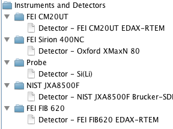

DTSA-II Setup
========================================================

These are John Minter's tips for setting up a consistent
DTSA-II installation across several computers with
different operating systems.

Our goal is to get ***consistent*** detectors and
standards. At the moment, much of this is kludgy.
DTSA seems to make it hard to change some of the
defaults. My long term goal is to be able to create
a reproducible environment from Jython scripts that
set up instruments, detectors, and standards from
version control.

# Initial setup

## Instrument/Detector setup

Note: I did try saving a 7zip archive of a base system
set up this way. We'll see if it is a useful alternative.
I'm not sure where DTSA stores directory preferences.
I have been unable to figure out how to initialize a clean
database without the default ``Probe`` instrument with its
default detector. All attempts to remove were successful
but did not reset the database, so it is best to just leave
it... The procedure below is kludgy, but it works...

Note that detectors can be imported from the
``$GIT_HOME/OSImageAnalysis/dtsa2/detectors``
directory. This will make strings in scripts much more
robust.

1. Start with a ***clean install***. You need to do the next steps ***in order***...
2. Go into Preferences and select the ``Instruments and Detector`` folder icon and the ``Add`` button. Click the dialog box and paste in ``FEI CM20UT`` in the name with a kV range from 40 to 200kV. Import the ``1-FEI CM20UT EDAX-RTEM.xdet`` detector. ***Restart DTSA*** to write the database.
3. Go into Preferences and select the ``Instruments and Detector`` folder icon and the ``Add`` button. Click the dialog box and paste in ``FEI FIB 620`` in the name with a kV range from 40 to 200kV. Import the ``2-FEI FIB 620 EDAX-RTEM.xdet`` detector. ***Restart DTSA*** to write the database.
4. Go into Preferences and select the ``Instruments and Detector`` folder icon and the ``Add`` button. Click the dialog box and paste in ``NIST JXA8500F`` in the name with a kV range from 40 to 200kV. Import the ``3-NIST JXA8500F Brucker-SDD.xdet`` detector. We add this detector to be able to work the DTSA examples. ***Restart DTSA*** to write the database.
5. Start DTSA and select the ``Command`` pane. Open the Jython script ``stds.py`` from ``$GIT_HOME/OSImageAnalysis/dtsa2/stds`` directory to load in the standards.


When you get done, the instruments preferences
should look like this:



Note these results from the command pane:

```
1> Database = dt2.DTSA2.getSession()
Database.getDetectors()
[NIST JXA8500F Brucker-SDD, Si(Li), FEI FIB620 EDAX-RTEM, FEI CM20UT EDAX-RTEM]
Elapse: 0:00:00.0
2> listDetectors()
Name  Detector
d4	NIST JXA8500F Brucker-SDD
d1	Si(Li)
d3	FEI FIB620 EDAX-RTEM
d2	FEI CM20UT EDAX-RTEM
3> Database.getElectronProbes()
{Probe=1, NIST JXA8500F=4, FEI CM20UT=2, FEI FIB 620=3}
4> listMaterials()
[Cu, Cu standard, Fe standard, K411, K412, Mn standard, Ni, SRM-484, SS-316, Zn standard]
5> 

```

Note how the Python dictionaries are listed in alphabetical order, but the indices are in the order we entered them. This means detector numbers like ``d1`` will be consistent.

***Note*** I tried to do this from Jython scripts but
seem to have trouble setting up and deleting instrument
directly from the scripts. One ***can*** zip up the documents and database folders and restore...


## Convenient environment variables

These are useful for scripts and lets you use
relative paths that don't break across systems.
Note that one should use ``/`` instead of ``\\`` 
on Windows as Linux/MacOSX. ***None*** of these are
terminated with a ``/`` .

1. ``HOME`` (typically already exists on Linux/MacOSX)
2. ``GIT_HOME`` root directory for repositories from github.
    You ***do*** use git...
3. ``IMG_ROOT`` root directory for image storage.

## Consistent materials and standards
I keep mine in
``$GIT_HOME/OSImageAnalysis/dtsa2/stds/stds.py``

This is helpful because

1. It is a text based file compatible with version control
2. One can add comments in the file with the source of the information.

## Odd, useful information
1. On MacOSX, the preferences are stored in ``$HOME/Library/Preferences/gov.nist.microanalysis.plist`` Note: editing this file is the easiest way to move the location of the default directories.
2. On Windows, the preferences are srored in the registry. The base key is ``[HKEY_CURRENT_USER\Software\JavaSoft\Prefs\gov]``. Note that the paths tend to use a lot of escapes. Note the Base Path key (``[HKEY_CURRENT_USER\Software\JavaSoft\Prefs\gov\nist\microanalysis\dtsa2]``) that is set to ``"/Base /Path"="/C:///Users//jrminter///My /Documents//work//dtsa"`` on crunch. One can export the whole configuration using ``regedit``
   